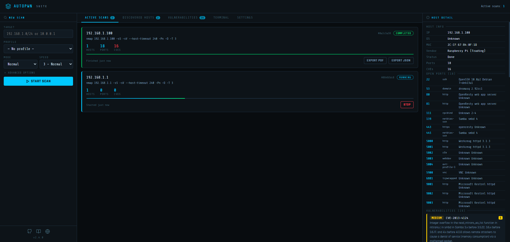
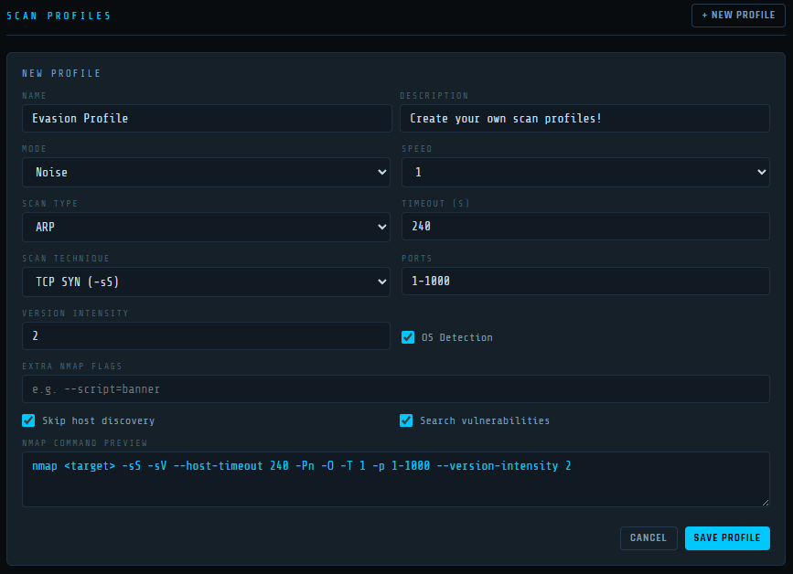
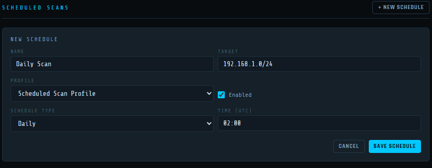
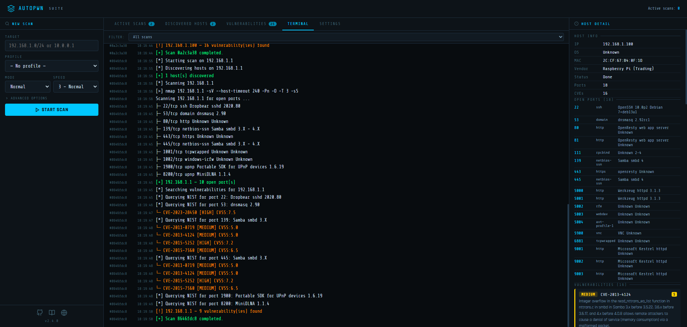

# AutoPWN Suite

AutoPWN Suite is a project for scanning vulnerabilities and exploiting systems automatically.


[](https://github.com/GamehunterKaan/AutoPWN-Suite/actions/workflows/tests.yml)


## Features

### CLI
- Fully [automatic](#usage) scanning and exploitation
- Detect network IP range without any user input
- Vulnerability detection based on service versions
- Web app vulnerability testing (LFI, XSS, SQLI)
- Web app directory busting
- Get information about vulnerabilities right from your terminal
- Automatically download exploits related to discovered vulnerabilities
- Noise mode for creating traffic on the network
- Evasion mode for stealthy scanning
- Automatically select scan types based on privilege level
- Easy to read output with rich formatting
- Specify arguments using a config file
- Send scan results via webhook or email
- Works on Windows, macOS and Linux
- Use as a [module](#module-usage)
- Use as a [daemon](#install-daemon) to periodically scan the network

### Web UI

AutoPWN Suite includes a built-in web dashboard for managing scans from your browser.



- **Multiple concurrent scans** - Launch and monitor several scans at the same time
- **Live terminal output** - Watch nmap commands and results in real time via SSE
- **Scan profiles** - Save and reuse scan configurations (technique, speed, timeout, ports, evasion, custom flags)
- **Scheduled scans** - Set up recurring scans on a cron schedule with automatic profile loading
- **Scan techniques** - Choose between TCP SYN, TCP Connect, UDP, Window, ACK, FIN, Xmas, Null, Maimon and SCTP scans
- **Evasion mode** - Fragmented packets, spoofed source port and padded data length
- **Email notifications** - Get notified on scan completion with inline result summaries
- **Webhook notifications** - Post scan results to any webhook endpoint
- **Persistent settings** - All settings, profiles and schedules are saved to disk
- **Configurable via environment variables** - Set host, port and data directory without touching code






## How Does It Work?

AutoPWN Suite uses nmap TCP-SYN scan to enumerate the host and detect the version of software running on it. After gathering enough information about the host, AutoPWN Suite automatically generates a list of keywords to search the [NIST vulnerability database.](https://www.nist.gov/)


## Demo

AutoPWN Suite has a very user friendly easy to read output.

[](https://asciinema.org/a/509345)


## Installation

### Windows
```bash
git clone https://github.com/GamehunterKaan/AutoPWN-Suite.git
cd AutoPWN-Suite
pip install -r requirements.txt
```

### Linux
For a system-wide installation on Linux (which requires root privileges), use the provided installation script. (Recommended)
```bash
# Install as root
sudo bash install.sh
# Uninstall
sudo bash uninstall.sh
```

You can clone the repo and create a virtual environment. This installation method can be used for non-root installation in Linux.
```bash
git clone https://github.com/GamehunterKaan/AutoPWN-Suite.git
cd AutoPWN-Suite
python3 -m venv .venv
source .venv/bin/activate
pip install -r requirements.txt
```

### Docker

The fastest way to get the web UI running:

```bash
git clone https://github.com/GamehunterKaan/AutoPWN-Suite.git
cd AutoPWN-Suite
docker compose up -d
```

The web UI will be available at `http://localhost:8080`.

#### Configuration

Edit `docker-compose.yml` to change host, port or data directory:

```yaml
environment:
  - AUTOPWN_DATA_DIR=/data        # Where settings/profiles/schedules are stored
  - AUTOPWN_WEB_HOST=0.0.0.0     # Listen address
  - AUTOPWN_WEB_PORT=8080        # Listen port
```

> **Note:** Host networking (`network_mode: host`) is required for nmap to discover and scan devices on your local network.

You can also run the CLI via Docker:
```bash
docker build -t autopwn-suite .
docker run -it --net=host autopwn-suite -t 192.168.1.0/24 -y
```

### Cloud
You can use Google Cloud Shell.

[](https://shell.cloud.google.com/cloudshell/editor?cloudshell_git_repo=https://github.com/GamehunterKaan/AutoPWN-Suite.git)


## Usage

Running with root privileges (sudo) is always recommended.

### CLI

#### Automatic Mode

```console
autopwn-suite -y
```

#### Scan a Specific Target

```console
autopwn-suite -t <target ip address>
```

#### Change Scanning Speed

```console
autopwn-suite -s <1, 2, 3, 4, 5>
```

#### Change Scanning Mode

```console
autopwn-suite -m <evade, noise, normal>
```

For more details about usage and flags use `-h` flag.

#### Install Daemon
```console
autopwn-suite --daemon-install
```

### Web UI

Launch the web dashboard:

```console
autopwn-suite --web
```

With custom host and port:

```console
autopwn-suite --web --web-host 0.0.0.0 --web-port 3000
```



### REST API

The web UI exposes a full REST API:

| Method | Endpoint | Description |
|--------|----------|-------------|
| `GET` | `/api/scans` | List all scan jobs |
| `POST` | `/api/scan/start` | Start a new scan |
| `POST` | `/api/scan/stop` | Stop a running scan |
| `GET` | `/api/hosts` | All discovered hosts (merged) |
| `GET` | `/api/log` | Log history |
| `GET` | `/api/events` | SSE event stream |
| `GET` | `/api/settings` | Get all settings |
| `PUT` | `/api/settings` | Update settings |
| `GET` | `/api/profiles` | List scan profiles |
| `POST` | `/api/profiles` | Create a profile |
| `PUT` | `/api/profiles/<id>` | Update a profile |
| `DELETE` | `/api/profiles/<id>` | Delete a profile |
| `GET` | `/api/schedules` | List scheduled scans |
| `POST` | `/api/schedules` | Create a schedule |
| `PUT` | `/api/schedules/<id>` | Update a schedule |
| `DELETE` | `/api/schedules/<id>` | Delete a schedule |


## Module Usage

```python
from autopwn_suite.api import AutoScanner

scanner = AutoScanner()
json_results = scanner.scan("192.168.0.1")
scanner.save_to_file("autopwn.json")
```


## Development and Testing

You can use poetry to install dependencies and run tests.

#### Installing Dependencies
```console
poetry install
```

#### Running Tests
```console
# Run all tests with coverage
poetry run test

# Run tests without coverage
poetry run test --no-cov

# Run only unit tests
poetry run test -m unit

# Run only integration tests
poetry run test -m integration

# Run tests excluding slow tests
poetry run test -m "not slow"
```

#### Running with Docker (Development)
```bash
docker compose up --build
```


## Contributing to AutoPWN Suite

I would be glad if you are willing to contribute this project. I am looking forward to merge your pull request unless its something that is not needed or just a personal preference. Also minor changes and bug fixes will not be merged. Please create an issue for those and I will do it myself. [Click here for more info!](https://github.com/GamehunterKaan/AutoPWN-Suite/blob/main/.github/CONTRIBUTING.md)


## Legal

You may not rent or lease, distribute, modify, sell or transfer the software to a third party. AutoPWN Suite is free for distribution, and modification with the condition that credit is provided to the creator and not used for commercial use. You may not use software for illegal or nefarious purposes. No liability for consequential damages to the maximum extent permitted by all applicable laws.


## Support or Contact

Having trouble using this tool? You can [create an issue](https://github.com/GamehunterKaan/AutoPWN-Suite/issues/new/choose) or [create a discussion!](https://github.com/GamehunterKaan/AutoPWN-Suite/discussions)
