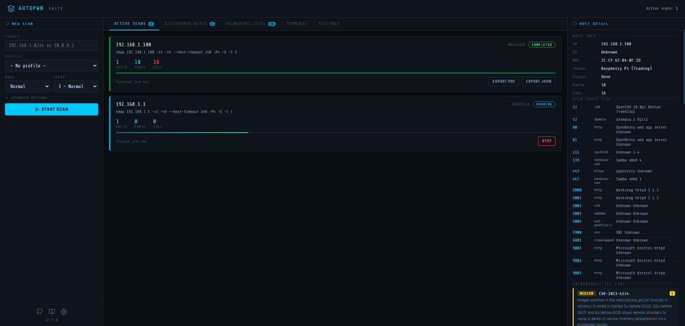
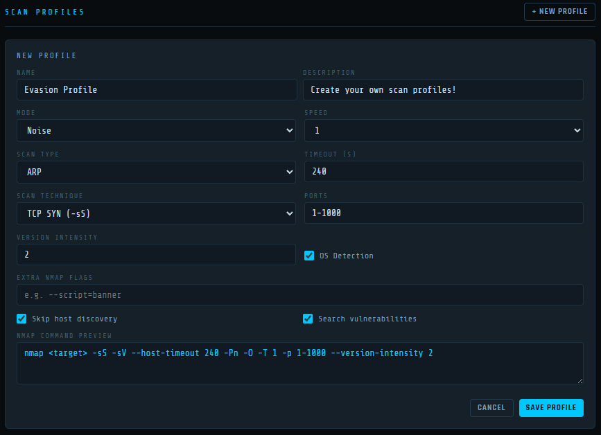
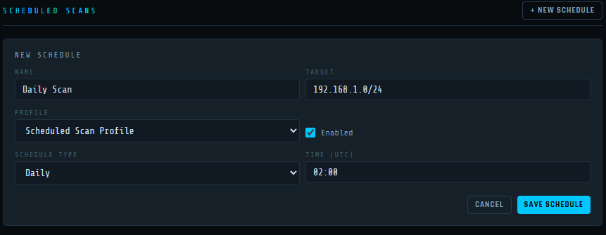
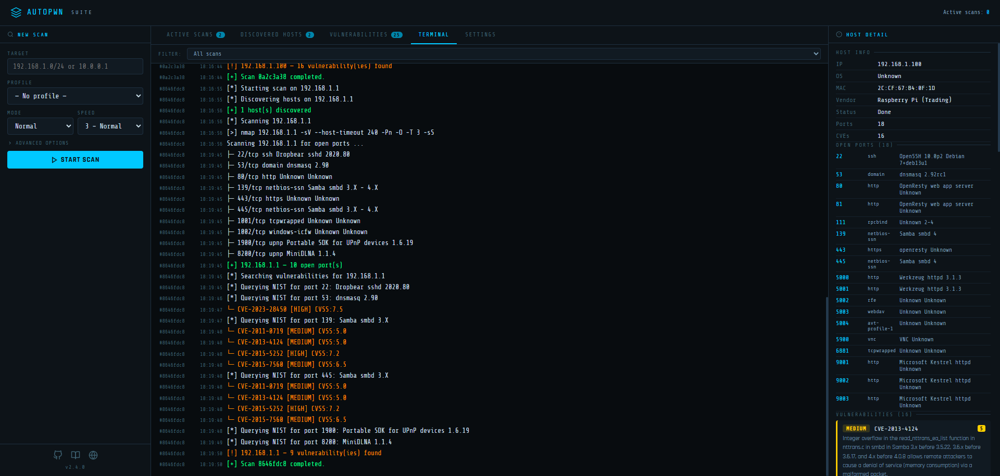

# AutoPWN Suite

AutoPWN Suite is a project for scanning vulnerabilities and exploiting systems automatically.


[](https://github.com/GamehunterKaan/AutoPWN-Suite/actions/workflows/tests.yml)


## Features

### CLI
- Fully [automatic](#usage) scanning and exploitation
- Detect network IP range without any user input
- Vulnerability detection based on service versions
- Web app vulnerability testing (LFI, XSS, SQLI)
- Web app directory busting
- Get information about vulnerabilities right from your terminal
- Automatically download exploits related to discovered vulnerabilities
- Noise mode for creating traffic on the network
- Evasion mode for stealthy scanning
- Automatically select scan types based on privilege level
- Easy to read output with rich formatting
- Specify arguments using a config file
- Send scan results via webhook or email
- Works on Windows, macOS and Linux
- Use as a [module](#module-usage)
- Use as a [daemon](#install-daemon) to periodically scan the network

### Web UI

AutoPWN Suite includes a built-in web dashboard for managing scans from your browser.



- **Multiple concurrent scans** - Launch and monitor several scans at the same time
- **Live terminal output** - Watch nmap commands and results in real time via SSE
- **Scan progress** - Live Nmap stage percentages, completed CVE lookup counts and target completion counters. The bar follows the current stage; stages without a reported percentage show ongoing activity. Stopped and failed scans retain their last measured progress.
- **Scan profiles** - Save and reuse scan configurations (technique, speed, timeout, ports, evasion, custom flags)
- **Scheduled scans** - Set up recurring scans on a cron schedule with automatic profile loading
- **Scan techniques** - Choose between TCP SYN, TCP Connect, UDP, Window, ACK, FIN, Xmas, Null, Maimon and SCTP scans
- **Evasion mode** - Fragmented packets, spoofed source port and padded data length
- **Email notifications** - Get notified on scan completion with inline result summaries
- **Webhook notifications** - Post scan results to any webhook endpoint
- **Persistent settings** - All settings, profiles and schedules are saved to disk
- **Configurable via environment variables** - Set host, port and data directory without touching code






## How Does It Work?

AutoPWN Suite uses nmap TCP-SYN scan to enumerate the host and detect the version of software running on it. After gathering enough information about the host, AutoPWN Suite automatically generates a list of keywords to search the [NIST vulnerability database.](https://www.nist.gov/)


## Offline vulnerability database

AutoPWN can keep a portable local mirror of the [NIST NVD JSON 2.0 feeds](https://nvd.nist.gov/vuln/data-feeds).
These are CVE records (descriptions, CVSS scores, affected-product configurations and references),
not exploit programs. The small NIST `.meta` files describe feed freshness, size and checksums;
downloading only those files is insufficient for vulnerability detection.

On a connected machine, explicitly download the database:

```bash
python autopwn.py --update-vuln-db
python autopwn.py --vuln-db-status
```

The first download covers all yearly feeds from 2002 through the current year, including
older CVEs contained in the 2002 feed. Allow several minutes and several GB of free disk space
for the database, feed processing and a temporary update copy. No NIST API key is required for
feed downloads. Repeat `--update-vuln-db` whenever you want fresh data. Each update checks every
year's metadata and downloads only changed yearly feeds, so updates also cover long periods
without internet. Checksums and record counts are verified before publishing the new database;
a failed or interrupted update preserves the previous database. Concurrent updates are rejected.
An update may need to be retried after active scans finish if the operating system locks the database file.

Run an airgapped scan with an explicit target:

```bash
python autopwn.py --offline -t 192.168.1.0/24 -y
python autopwn.py --web --offline
```

Offline mode uses local CVE lookups, skips internet connectivity checks, exploit downloads,
web application probes, automatic Nmap installation and email/webhook delivery, and disables
Nmap reverse DNS. Nmap still communicates with the requested scan targets. Use IP addresses
and locally installed Nmap scripts; user-supplied hostnames or scripts may have their own network
requirements. Install Python dependencies and Nmap before disconnecting, or transfer installation
packages from a connected machine. The dashboard uses local assets and system fonts.

The default `--vuln-source auto` tries online NVD lookups and falls back to a ready local database
if NVD is unavailable, staying local for the rest of that scan. `--vuln-source online` requires
online lookups. Use `--offline` (or `--vuln-source offline`) to avoid trying NVD at all.
Missing or invalid local data fails explicitly rather than reporting a clean vulnerability scan.
Stored data remains usable without an expiry; its update time is shown in scan logs and dashboard
results. Offline matching uses description keyword prefixes, with all query terms required,
and keeps versions such as `10.1.18` distinct from a query for `1.1`. As with online keyword scans,
findings are possible vulnerabilities, not proof of exploitability or exact version applicability.

In the dashboard, **Settings → Offline vulnerability database** provides manual Download/Update,
progress, CVE count, update time and an **Export for airgapped system** link. Select the vulnerability
data source in **New Scan** or save it in a scan profile for scheduled scans. Starting the server
with `--offline` forces every scan to use local data and blocks downloads and test notifications.
The **Offline mode — whole dashboard** toggle in Settings saves this preference across restarts
and overrides the source for all new and scheduled scans. It also blocks downloads and notifications.
Turn it off when you want to download updates. Finish or stop active online scans and let any database
update or pending notification finish before turning it on. A server started with `--offline` keeps offline mode enforced.

The default file is `modules/vulnerabilities.sqlite3`, or `AUTOPWN_DATA_DIR/vulnerabilities.sqlite3`
when that environment variable is set. Copy this single file to the airgapped machine's data
directory, or select its location explicitly:

```bash
python autopwn.py --offline --vuln-db /media/transfer/vulnerabilities.sqlite3 -t 192.168.1.10
python autopwn.py --web --offline --vuln-db /media/transfer/vulnerabilities.sqlite3
```

The database contains public vulnerability data, without scan targets, credentials or exploit files.
It is portable between platforms. Configuration files also support `offline`, `vulnerability_source`
and `vuln_db` in `[AUTOPWN]`. Python callers can use
`AutoScanner().scan("192.168.1.10", offline=True, vuln_db="/path/vulnerabilities.sqlite3")`.

## Demo

AutoPWN Suite has a very user friendly easy to read output.

[](https://asciinema.org/a/509345)


## Installation

### Windows
```bash
git clone https://github.com/GamehunterKaan/AutoPWN-Suite.git
cd AutoPWN-Suite
pip install -r requirements.txt
```

### Linux
For a system-wide installation on Linux (which requires root privileges), use the provided installation script. (Recommended)
```bash
# Install as root
sudo bash install.sh
# Uninstall
sudo bash uninstall.sh
```

You can clone the repo and create a virtual environment. This installation method can be used for non-root installation in Linux.
```bash
git clone https://github.com/GamehunterKaan/AutoPWN-Suite.git
cd AutoPWN-Suite
python3 -m venv .venv
source .venv/bin/activate
pip install -r requirements.txt
```

### Docker

The fastest way to get the web UI running. Download the [docker-compose.yml](https://raw.githubusercontent.com/GamehunterKaan/AutoPWN-Suite/main/docker-compose.yml) file and run:

```bash
docker compose up -d
```

The web UI will be available at `http://localhost:8080`.

#### Configuration

Edit `docker-compose.yml` to change host, port or data directory:

```yaml
environment:
  - AUTOPWN_DATA_DIR=/data        # Where settings/profiles/schedules are stored
  - AUTOPWN_WEB_HOST=0.0.0.0     # Listen address
  - AUTOPWN_WEB_PORT=8080        # Listen port
```

> **Note:** Host networking (`network_mode: host`) is required for nmap to discover and scan devices on your local network.

You can also run the CLI via Docker:
```bash
docker run -it --net=host gamehunterkaan/autopwn-suite -t 192.168.1.0/24 -y
```

### Cloud
You can use Google Cloud Shell.

[](https://shell.cloud.google.com/cloudshell/editor?cloudshell_git_repo=https://github.com/GamehunterKaan/AutoPWN-Suite.git)


## Usage

Running with root privileges (sudo) is always recommended.

### CLI

#### Automatic Mode

```console
autopwn-suite -y
```

#### Scan a Specific Target

```console
autopwn-suite -t <target ip address>
```

#### Change Scanning Speed

```console
autopwn-suite -s <1, 2, 3, 4, 5>
```

#### Change Scanning Mode

```console
autopwn-suite -m <evade, noise, normal>
```

For more details about usage and flags use `-h` flag.

#### Install Daemon
```console
autopwn-suite --daemon-install
```

### Web UI

Launch the web dashboard:

```console
autopwn-suite --web
```

With custom host and port:

```console
autopwn-suite --web --web-host 0.0.0.0 --web-port 3000
```



### REST API

The web UI exposes a full REST API:

| Method | Endpoint | Description |
|--------|----------|-------------|
| `GET` | `/api/scans` | List all scan jobs |
| `POST` | `/api/scan/start` | Start a new scan |
| `POST` | `/api/scan/stop` | Stop a running scan |
| `GET` | `/api/hosts` | All discovered hosts (merged) |
| `GET` | `/api/log` | Log history |
| `GET` | `/api/events` | SSE event stream |
| `GET` | `/api/settings` | Get all settings |
| `PUT` | `/api/settings` | Update settings |
| `GET` | `/api/profiles` | List scan profiles |
| `POST` | `/api/profiles` | Create a profile |
| `PUT` | `/api/profiles/<id>` | Update a profile |
| `DELETE` | `/api/profiles/<id>` | Delete a profile |
| `GET` | `/api/schedules` | List scheduled scans |
| `POST` | `/api/schedules` | Create a schedule |
| `PUT` | `/api/schedules/<id>` | Update a schedule |
| `DELETE` | `/api/schedules/<id>` | Delete a schedule |


## Module Usage

```python
from autopwn_suite.api import AutoScanner

scanner = AutoScanner()
json_results = scanner.scan("192.168.0.1")
scanner.save_to_file("autopwn.json")
```


## Development and Testing

You can use poetry to install dependencies and run tests.

#### Installing Dependencies
```console
poetry install
```

#### Running Tests
```console
# Run all tests with coverage
poetry run test

# Run tests without coverage
poetry run test --no-cov

# Run only unit tests
poetry run test -m unit

# Run only integration tests
poetry run test -m integration

# Run tests excluding slow tests
poetry run test -m "not slow"
```

#### Running with Docker (Development)
```bash
docker compose up --build
```


## Contributing to AutoPWN Suite

I would be glad if you are willing to contribute this project. I am looking forward to merge your pull request unless its something that is not needed or just a personal preference. Also minor changes and bug fixes will not be merged. Please create an issue for those and I will do it myself. [Click here for more info!](https://github.com/GamehunterKaan/AutoPWN-Suite/blob/main/.github/CONTRIBUTING.md)


## Legal

You may not rent or lease, distribute, modify, sell or transfer the software to a third party. AutoPWN Suite is free for distribution, and modification with the condition that credit is provided to the creator and not used for commercial use. You may not use software for illegal or nefarious purposes. No liability for consequential damages to the maximum extent permitted by all applicable laws.


## Support or Contact

Having trouble using this tool? You can [create an issue](https://github.com/GamehunterKaan/AutoPWN-Suite/issues/new/choose) or [create a discussion!](https://github.com/GamehunterKaan/AutoPWN-Suite/discussions)
